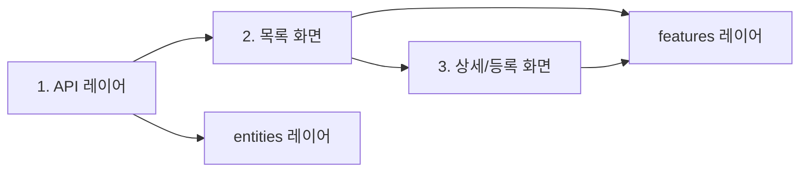

# 프론트엔드 개발 가이드

## 📚 개요

이 문서는 FSD(Feature-Sliced Design) 아키텍처를 기반으로 한 React + TypeScript 프로젝트의 개발 가이드라인과 실무에서 바로 활용할 수 있는 샘플 코드를 제공합니다.

## 🎯 목적

- **일관된 코드 스타일**: 팀 내 모든 개발자가 동일한 패턴으로 개발
- **개발 생산성 향상**: 검증된 샘플 코드를 통한 빠른 개발
- **코드 품질 향상**: 모범 사례와 컨벤션을 통한 유지보수성 증대
- **MCP 서버 활용**: Claude와의 대화를 통한 개발 지원

## 📖 문서 구성

### 1. 필수 가이드

#### [🏗️ FSD 아키텍처 가이드](./02-fsd-guidelines.md) ⭐️ 필독

- FSD 아키텍처 개요 및 핵심 원칙
- 계층 구조와 의존성 규칙
- 타입 선언 위치 가이드
- Import 규칙 및 Public API 패턴
- 자주 발생하는 위반 사항 및 해결 방법

#### [🎨 코딩 스타일 가이드](./04-coding-style-guide.md)

- TypeScript 타입 정의 규칙
- React 컴포넌트 작성 패턴
- Hook 작성 및 상태 관리 규칙
- 에러 처리 및 네이밍 컨벤션

#### [🌐 API 패턴 가이드](./03-api-patterns-guide.md)

- React Query를 활용한 API 호출 패턴
- 에러 처리 및 캐싱 전략
- 페이지네이션 및 무한 스크롤
- 실시간 업데이트 패턴

### 2. 샘플 코드 (⭐️ 최신)

#### [🔌 API 레이어 샘플](./sample-codes/01-api-layer.md) - 가장 먼저 구현

- Axios 클라이언트 설정
- React Query 기반 API 훅
- 타입 정의 및 에러 처리
- FSD entities 레이어 구현

#### [📋 목록 조회 화면 샘플](./sample-codes/02-list-page.md)

- SearchBox + Divider + GridBox 패턴
- useDynamicForm2 & useGridBox 활용
- 페이지네이션 및 정렬
- 라우터 기반 상세 페이지 연동

#### [📝 상세/등록 화면 샘플](./sample-codes/03-detail-page.md)

- CREATE/UPDATE 모드 통합
- useDynamicForm2 폼 관리
- 라우터 state를 통한 데이터 전달
- 목록 페이지 상태 유지

### 3. 컴포넌트 가이드

#### [⚛️ 컴포넌트 가이드](./05-component-guide.md)

- 컴포넌트 분류 및 설계 원칙
- Props 설계 패턴
- 렌더링 최적화
- 접근성 고려사항

#### [🧪 테스트 가이드](./06-testing-guide.md)

- 테스트 전략 및 우선순위
- 단위/통합/E2E 테스트
- 테스트 유틸리티
- 커버리지 관리

## 🚀 빠른 시작 가이드

### 새로운 화면 개발 순서



### 1단계: API 레이어 구현

```typescript
// entities/user/api/user.ts
export const userApi = {
  getUsers: (params: UserListParams) => apiClient.get<UserListResponse>('/users', { params }),
  getUser: (id: string) => apiClient.get<User>(`/users/${id}`),
};

// entities/user/service/user.hook.ts
export const userQueryOptions = {
  getUsers: (params: UserListParams) => ({
    queryKey: ['users', params],
    queryFn: () => userApi.getUsers(params),
  }),
};
```

### 2단계: 목록 화면 구현

```typescript
// features/user-management/ui/user-list.tsx
export const UserList = () => {
  const { config, gridFetch } = useGridBox(gridConfig);

  return (
    <>
      <UserSearchBox onSearch={gridFetch} />
      <Divider />
      <GridBox config={config} columns={columns} />
    </>
  );
};
```

### 3단계: 상세/등록 화면 구현

```typescript
// pages/user-management/detail.tsx
export const UserDetail = () => {
  const { mode, data } = useFetchUserInfo();
  const form = useDynamicForm2({ defaultValues: data });

  return (
    <form onSubmit={form.onSubmit(handleSubmit)}>
      <UserDetailForm form={form} mode={mode} />
    </form>
  );
};
```

## ❗️ 반드시 지켜야 할 것

### 1. FSD 계층 규칙

```typescript
// ✅ 올바른 의존성
pages → widgets → features → entities → shared

// ❌ 금지된 의존성
features → widgets  // 하위 → 상위
features → features // 같은 레벨
```

### 2. Public API 사용

```typescript
// ✅ 올바른 import
import { UserCard } from '@entities/user';

// ❌ 잘못된 import
import { UserCard } from '@entities/user/ui/user-card';
```

### 3. 프로젝트 표준 훅 사용

```typescript
// ✅ 표준 훅 사용
const form = useDynamicForm2();
const { config, gridFetch } = useGridBox();

// ❌ 직접 구현
const [formData, setFormData] = useState();
```

## ⛔️ 하지 말아야 할 것

### 1. 상대 경로 import

```typescript
// ❌ 금지
import { Button } from '../../../shared/ui';

// ✅ 절대 경로 사용
import { Button } from '@shared/ui';
```

### 2. 직접적인 API 호출

```typescript
// ❌ 금지
const data = await axios.get('/users');

// ✅ React Query 사용
const { data } = useQuery(userQueryOptions.getUsers());
```

### 3. 컴포넌트 내 비즈니스 로직

```typescript
// ❌ 금지
const UserList = () => {
  const handleSave = async () => {
    const result = await axios.post('/users', data);
    // 복잡한 로직...
  };
};

// ✅ 훅으로 분리
const useUserForm = () => {
  const { mutate } = useCreateUser();
  return { handleSave: mutate };
};
```

## 🛠️ 개발 도구 및 자동화

### ESLint & Prettier

```bash
# 린트 검사
npm run lint

# 자동 수정
npm run lint:fix
```

### FSD 아키텍처 검사

```bash
# FSD 위반 사항 검사
npm run fsd:check

# 자동 수정
npm run fsd:fix
```

### Pre-commit 훅

- 자동으로 ESLint + Prettier 실행
- FSD 위반 사항 경고 (커밋은 진행)

## 🤝 기여 방법

1. **문서 개선**: 오타 수정, 내용 보완
2. **샘플 코드 추가**: 새로운 패턴 예시
3. **버그 리포트**: 문서나 코드의 문제점 공유
4. **개선 제안**: 더 나은 패턴 제안

---

**이 가이드는 살아있는 문서입니다.**
프로젝트와 함께 지속적으로 발전하며, 모든 팀원의 기여를 환영합니다.
