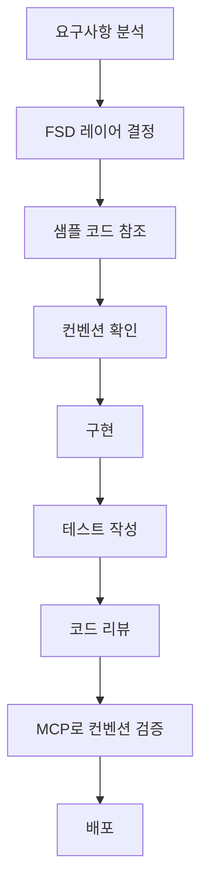

# 개발 컨벤션 및 샘플 코드 가이드

## 📚 개요

이 문서 모음은 FSD(Feature-Sliced Design) 아키텍처를 기반으로 한 React + TypeScript 프로젝트의 개발 가이드라인과 실무에서 바로 활용할 수 있는 샘플 코드를 제공합니다.

## 🎯 목적

- **일관된 코드 스타일**: 팀 내 모든 개발자가 동일한 패턴으로 개발
- **개발 생산성 향상**: 검증된 샘플 코드를 통한 빠른 개발
- **코드 품질 향상**: 모범 사례와 컨벤션을 통한 유지보수성 증대
- **MCP 서버 활용**: Claude와의 대화를 통한 개발 지원

## 📖 문서 구성

### 1. 컨벤션 가이드

#### [🏗️ FSD 아키텍처 가이드](./fsd-guidelines.md)
- FSD 아키텍처 개요 및 핵심 원칙
- 계층 구조와 의존성 규칙
- Import 규칙 및 폴더 구조 표준
- Public API 패턴 (Barrel/Re-export)
- 자동화 도구 및 ESLint 설정

#### [🎨 코딩 스타일 가이드](./coding-style-guide.md)
- TypeScript 타입 정의 규칙
- React 컴포넌트 작성 패턴
- Hook 작성 및 상태 관리 규칙
- 에러 처리 및 네이밍 컨벤션
- 코드 포맷팅 및 Import 정리

#### [🌐 API 패턴 가이드](./api-patterns-guide.md)
- React Query를 활용한 API 호출 패턴
- 에러 처리 및 캐싱 전략
- 페이지네이션 및 무한 스크롤
- 성능 최적화 기법
- 실시간 업데이트 패턴

#### [⚛️ 컴포넌트 가이드](./component-guide.md)
- 컴포넌트 아키텍처 및 분류
- Props 설계 및 상태 관리
- 렌더링 최적화
- 접근성 고려사항
- 테스팅 전략

#### [🧪 테스트 가이드](./testing-guide.md)
- 테스트 전략 및 피라미드
- 단위/통합/E2E 테스트 작성법
- 모킹 전략 및 테스트 유틸리티
- 접근성 및 성능 테스트
- 테스트 커버리지 관리

### 2. 샘플 코드

#### [📋 목록 조회 화면 샘플](./sample-codes/list-page-sample.md)
- 검색, 필터링, 페이지네이션이 포함된 완전한 목록 화면
- FSD 아키텍처를 준수한 계층별 구현
- React Query를 활용한 데이터 관리
- 재사용 가능한 컴포넌트 설계

**주요 구성 요소:**
- API 레이어 (entities)
- React Query 훅 (service)
- 검색 폼 & 테이블 컴포넌트 (features)
- 페이지네이션 컴포넌트 (shared)
- 통합 위젯 (widgets)

#### [📝 상세/등록 모드 화면 샘플](./sample-codes/modal-form-sample.md)
- Mode prop을 활용한 통합 모달 폼 (view/edit/create)
- React Hook Form + Zod를 활용한 폼 검증
- 접근성을 고려한 모달 컴포넌트
- 에러 처리 및 로딩 상태 관리

**주요 구성 요소:**
- 검증 스키마 (Zod)
- 모달 컴포넌트 (shared)
- 폼 필드 컴포넌트 (shared)
- 통합 사용자 폼 (features)
- 라우터 연동 예시

#### [🔌 API 통합 패턴 샘플](./sample-codes/api-integration-sample.md)
- 완전한 API 클라이언트 설정
- React Query와 MSW를 활용한 데이터 관리
- 배치 작업 및 파일 업로드
- 실시간 업데이트 지원

**주요 구성 요소:**
- Axios 클라이언트 설정 (shared/api)
- 에러 핸들러 (shared/api)
- Query/Mutation 패턴 (entities)
- 실시간 업데이트 훅 (service)
- 캐시 관리 유틸리티

## 🛠️ MCP 서버 연동

### keyword-rag-mcp 활용법

이 문서들을 [keyword-rag-mcp](https://github.com/cskwork/keyword-rag-mcp) 서버에 등록하여 Claude Desktop과 연동하면 다음과 같은 개발 지원을 받을 수 있습니다:

#### 1. 실시간 컨벤션 참조
```
개발자: "FSD에서 features간 import는 어떻게 해야 하지?"
Claude: [MCP가 fsd-guidelines.md 검색] 
"FSD에서는 같은 레벨(features ↔ features) import가 금지됩니다..."
```

#### 2. 샘플 코드 활용
```
개발자: "목록 화면 구현 샘플 코드 보여줘"
Claude: [list-page-sample.md 검색하여 관련 코드 제공]
```

#### 3. 개발 패턴 지원
```
개발자: "React Query 훅을 어떻게 작성해야 할까?"
Claude: [api-patterns-guide.md 참조하여 구체적인 패턴 제시]
```

### MCP 서버 설정 방법

1. **keyword-rag-mcp 설치**
   ```bash
   git clone https://github.com/cskwork/keyword-rag-mcp
   cd keyword-rag-mcp
   npm install
   npm run build
   ```

2. **문서 폴더 설정**
   ```bash
   # docs 폴더를 MCP 서버의 documents 폴더에 복사 또는 심볼릭 링크 생성
   ln -s /path/to/your/project/docs /path/to/keyword-rag-mcp/documents/dev-guide
   ```

3. **Claude Desktop 설정**
   ```json
   {
     "mcpServers": {
       "keyword-rag": {
         "command": "node",
         "args": ["path/to/keyword-rag-mcp/dist/index.js"],
         "cwd": "path/to/keyword-rag-mcp"
       }
     }
   }
   ```

## 🚀 빠른 시작

### 1. 새로운 기능 개발 시

1. **FSD 아키텍처 확인**: [fsd-guidelines.md](./fsd-guidelines.md)에서 적절한 레이어 확인
2. **샘플 코드 참조**: 유사한 기능의 샘플 코드를 참조하여 구조 파악
3. **컨벤션 준수**: 코딩 스타일 가이드에 따라 구현
4. **테스트 작성**: 테스트 가이드를 참조하여 적절한 테스트 작성

### 2. 목록 화면 개발

```typescript
// 1. API 정의 (entities 레이어)
// entities/user/api/user.ts 참조

// 2. React Query 훅 작성 (entities 레이어)
// entities/user/service/user.hook.ts 참조

// 3. UI 컴포넌트 작성 (features 레이어)
// features/user-management/ui/user-list.tsx 참조
```

### 3. 폼 모달 개발

```typescript
// 1. 검증 스키마 정의
// features/user-management/lib/user-validation.ts 참조

// 2. 모달 컴포넌트 구현
// features/user-management/ui/user-detail-modal.tsx 참조

// 3. 폼 컴포넌트 구현
// features/user-management/ui/user-form.tsx 참조
```

## 📊 개발 플로우



## 🔄 지속적 개선

### 문서 업데이트
- 새로운 패턴이나 컨벤션 발견 시 문서 업데이트
- 샘플 코드의 버그 수정 및 개선사항 반영
- 팀 피드백을 통한 가이드라인 개선

### MCP 서버 최적화
- 자주 검색되는 패턴의 키워드 최적화
- 새로운 문서 추가 시 인덱싱 업데이트
- 검색 결과의 정확도 개선

## 🤝 기여 방법

1. **문서 개선**: 오타 수정, 내용 보완, 새로운 샘플 코드 추가
2. **패턴 제안**: 새로운 개발 패턴이나 컨벤션 제안
3. **피드백 제공**: 실제 사용 경험을 바탕으로 한 개선 제안
4. **이슈 리포팅**: 문서나 샘플 코드의 문제점 신고

## 📞 지원

- **팀 내 질문**: Slack #dev-support 채널 활용
- **MCP 관련 이슈**: keyword-rag-mcp GitHub 이슈 등록
- **컨벤션 논의**: 정기 개발팀 미팅에서 논의

---

**이 가이드는 살아있는 문서입니다.** 
프로젝트의 성장과 함께 지속적으로 업데이트되며, 모든 팀원의 피드백을 환영합니다.